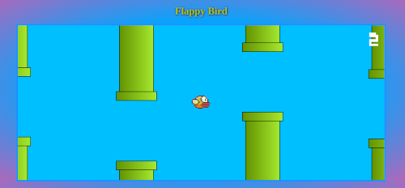

# flappy_Bird




Here are the technologies used in this project.
 

* JavaScript
* Html5
* CSS3

under development
* Browser-sync
* GIMP v2.0
 
 
## Services Used
 
* Github
 
<!-- ## Ruby Gems
... -->
 
## Getting started
 
* To Download:

>	Ubuntu, Debian, Mint, others:<br>
	  ```
	 	 sudo apt-get install wget
	  ```

>	Fedora, CentOS:<br>
	```
		dnf install wget
	```<br>
	```
		yum install wget
	```

>	openSUSE:<br>
	```
		zypper install wget
	```

>	after installing:<br>
	```
		wget https://github.com/ysh-rael/flappy_Bird/archive/refs/heads/main.zip
	```

* To run the project:
>    [click here](https://ysh-rael.github.io/input-range/)
 
## How to use
 
The game starts as soon as the page loads..<br>

> The same button is used to pause and play the video, changing, in addition to its functionality, the icon and verifying that autoplay is activated to suit it.<br>

> Move the bird through the pipes without letting it hit any. press any keyboard key to make it fly.

 
## Features
 * FlappyBird game
	- Collision detection
	- score marker
 * Responsive
	- Desktop version: ON
	- Mobile version: OFF


 
 
## Links
 
  - Link of deployed application: https://ysh-rael.github.io/flappy_Bird/
  - Repository: https://github.com/ysh-rael/flappy_Bird/
 
 
## Versioning
 
1.0.0.0
 
 
## Authors
 
* **Yshrael Pimentel**: @Ysh-rael (https://github.com/ysh-rael)
 
 
Please follow github and join us!
Thanks to visiting me and good coding!
